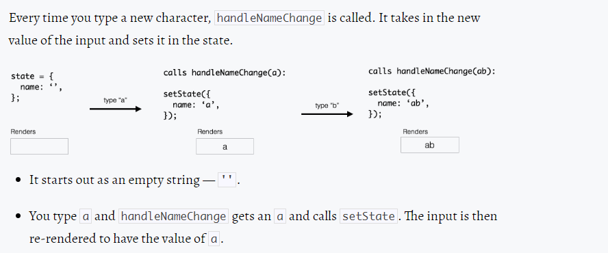

>## Crash Course into Redux
This is basically a react practice crash course to understand the fundamentals of react and to track my react journey along the way with Tyler Mcginnis bootcamp and a few other tuts along the way.
- React is a library for building user interfaces
- React basically gives us details into
    - Composition
    - Unideirectional Dataflow
    - Explicit mutations
    - Just Javascript

- `Composition` deals with how we can compose various blocks of components and we are able to group or compose all these components together
### Important
JSX is transpiled into objects by babel so to learn how react works we can use React.createELement to understand the flow

  ```
  React.createElement(
    'html tag',
    'attributes we want to add on the tag',
    'and the children i.e. content'
  )
  ```
Below is the reprsentation of a create element for _header tag_
  ```
  React.createElement(
    'h1',
    {id : 'header'},
    'Tyler'
  )
  ```
equivalent to `<h1 id="header">Tyler</h1>`
- createElement is going to create an object representation of the dom node(tag)
- the first argument it takes in is the html tag
#### React DOM
- React basically keeps a object representation of the actual DOM so that it can keep track of the changes an update only those nodes

#### Component
- A component is a function or a class which optionally accepts a input and returns a react element

- We can also pass components to `React.createElement(NameComponent)`
- We can basically pass data i.e. props into our components 
`React.createElement(NameComponent,{name:"Claudia"})`
- Instead of using all the createElement objects to create dom nodes we can use JSX ,which stands for Javascript and XML it's an amalgam of the two to give us the best of both worlds.
- Babel helps us a lot to convert JSX into object representaional form .[Try Babel out here](babeljs.io)
- We can use map to loop over the array.
- _To use state to manage our data use class component rather than functional component._
    - This is the reason class components are called stateful components and functional components are stateless & are best for endering ui.

- I am using class properties to define `state` in my class instead of defining it in a constructor.Class properties are in stage3 proposal for Js , but if we are using babel which we are in this project it transpiles it accordingly
[To know more Read Dave Ceddia's amazing article](https://daveceddia.com/where-initialize-state-react/)

#### Update state
- To update state in React we can use `setState()` and we cannot update state as we assign values to properties in Js
`this.state.friends = this.state.friends.filter(friend => friend !== name)`

- this code above is a bad idea as in functional programminh  mutating the state directly is not a good practice. plus react would not have any idea that the state changed
- **Whenever we pass a function to setState() react is going to invoke that function and is going to pass the current state of the component to it**
- **i.e. setState() is a callback that takes in the currentstate and returns the new state**
##### Invoking inside a component
 We can send our function as a props to our component
 Below we are passing a function invocation to onClick event
  ```
  <button onClick={props.onRemoveFriend(name)}>Remove</button>
  ```
  - **If we do the above way instead of a arrow function then as soon as the component loads `props.onRemoveFriend` will be invoked immediately.But if we want the function to be invoked when it is clicked we can follow the below style of using an arrow function**
  Below we are passing a function definition to onClick
  ```
  <button onClick={() =>props.onRemoveFriend(name)}>Remove</button>
  ```
#### Update state through input field
- If the state of the form is controlled by react its called a controlled component
 
[For more info on controlled and uncontrolled components](https://goshakkk.name/controlled-vs-uncontrolled-inputs-react/)

- state is basically like giving inital value to our properties and for getting state from input fields we can use 
- difference between
  **object setState**
 ```
  this.setState({input : value})
  ```
  and **functional setState**
  ```
  this.setState(() =>({
    input:value
  }))
  ```
  - **If we are updating the local state of our component based on the previous state we need to use functional setState**

