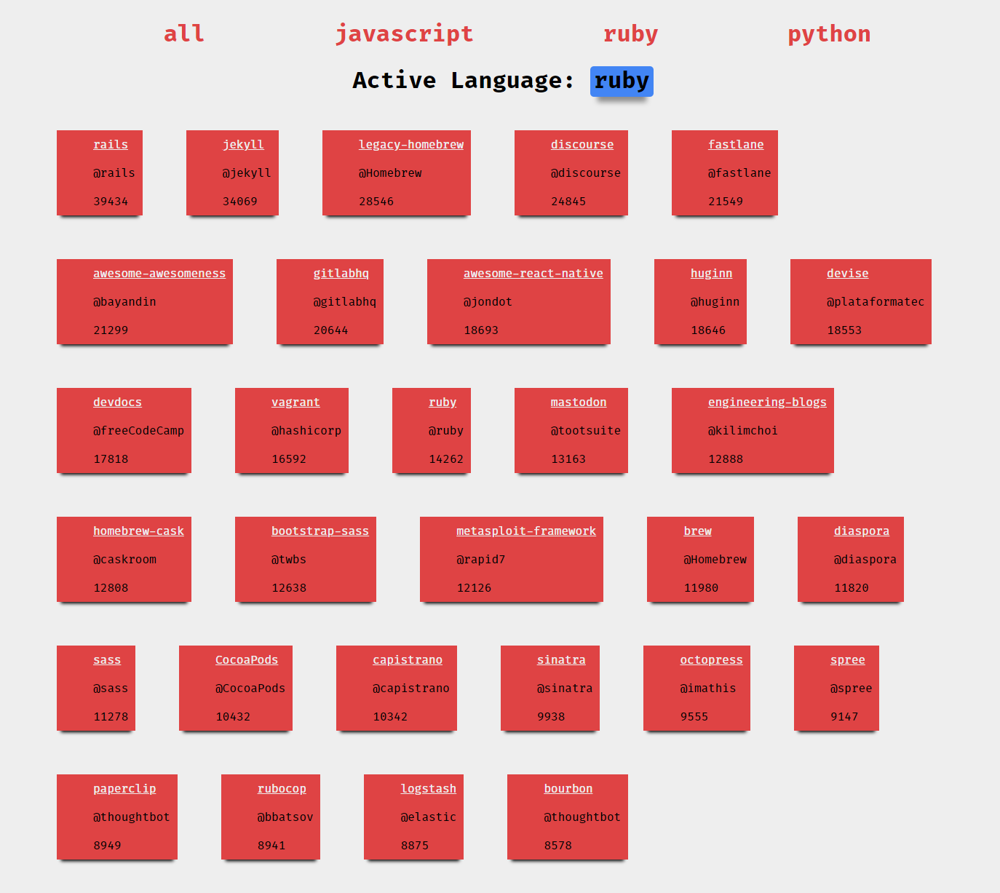

  # [Demo link](https://claudz1.github.io/React-practice/assignment-1/index.html)

- We use `{JSON.stringify(this.state.repos)}` to fetch repos which converts the data  into a JSON format

- Basically for inline styles in jsx we use style attribute on the jsx tag which takes in an object and follows **camelCase** formatting for attributes
`<ul style={{display : 'flex', flexWrap : 'wrap'}} >`

- We have used destructuring which is an Es6 feature which is a shorthand property
  - i.e. we grab the properties from the object directly instead of accessing the object first
[Read more about it here](https://wesbos.com/destructuring-objects/)

- We have used componentDidUpdate() to look for upadte changes and if there are any update the state